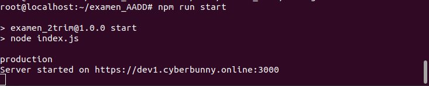
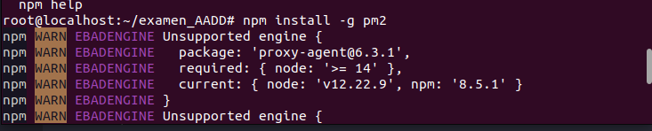
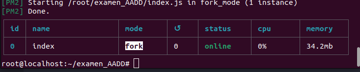
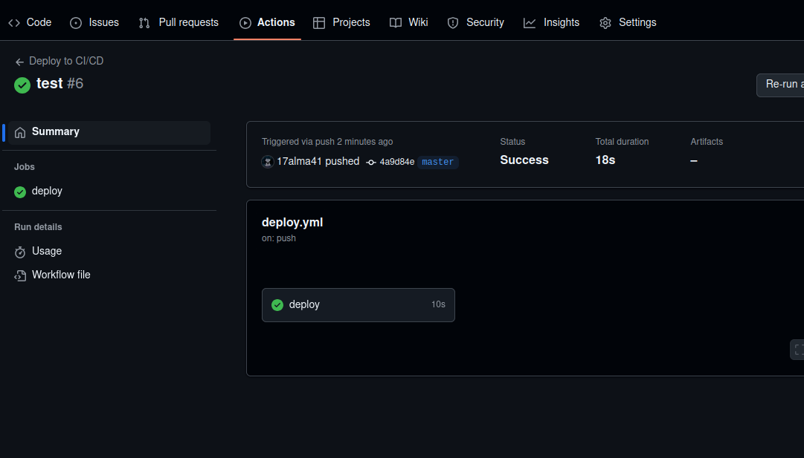
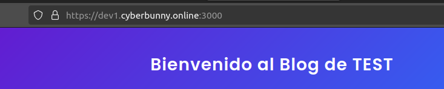

# Examen 2º Trimestre

## Despliegue HTTPS
1. Para el despliegue de nuestro servidor debemos crear un index.js con la configuración necesaria:
```js
app.get('/', (req, res) => {
  res.send('Bienvenido al despliegue del servidor de Alvaro!');
})


console.log(process.env.NODE_ENV); // Process.env busca la variable de entorno NODE_ENV en el proyecto
if(process.env.NODE_ENV === 'production'){

  const options = {
    key: fs.readFileSync(path.join(__dirname, 'privkey.pem')),
    cert: fs.readFileSync(path.join(__dirname, 'fullchain.pem'))
  };

  // Crear el servidor HTTPS
  https.createServer(options, app).listen(port, () => {
    console.log(`Server started on https://dev1.cyberbunny.online:${port}`);
  });
  
}else{

  // Crear el servidor HTTP
  http.createServer(app).listen(port, () => {
    console.log(`Server started on http://localhost:${port} o http://yourIP:${port}`);
  });
}
```

2. Configuramos nuestro .env dependiendo si lo queremos en "production" que se despliega con https o no configurandolo que automáticamente se nos desplegará en http.

3. Luego accederemos a nuestro servidor desde la consola.
```bash
ssh root@ip
```

4. Siguiendo de esto, ejecturemos el ./deploy.sh de la siguiente manera:
```bash
chmod +x deploy.sh
./deploy.sh
```

5. Comprobamos los certificados de https.

6. Verificamos que arranca.
  



7. Instalamos y ejecutamos PM2
  




## CORS
Hemos añadido CORS a todo los endpoints de la web:
```js
app.use(cors()); // Se puede añadir a todas las rutas
```

## Deploy CI/CD
1. Crear un repositorio en GitHub
2. Crear una carpeta llamada `.github/workflows`
    2.1. Dentro de la carpeta crear un archivo llamado deploy.yml:

```yaml
name: Deploy to CI/CD

on:
push:
branches:
    - master

jobs:
deploy:
runs-on: ubuntu-latest

steps:
- name: Checkout repository
    uses: actions/checkout@v2

- name: Install sshpass
    run: sudo apt-get install -y sshpass

- name: Create .ssh directory
    run: mkdir -p ~/.ssh

- name: Add remote host to known_hosts
    run: ssh-keyscan -H ${{ secrets.SSH_HOST }} >> ~/.ssh/known_hosts

- name: Execute command on VPS
    env:
    SSHPASS: ${{ secrets.SSH_PASSWORD }}
    run: sshpass -e ssh ${{ secrets.SSH_USER }}@${{ secrets.SSH_HOST }} "pm2 stop index && cd examen_AADD && git pull && npm install && pm2 start index &"
```

3. Subir el flujo de trabajo
```bash
git add .
git commit -m "Agregar flujo de trabajo CI"
git push 
```

4. Añadir secretos en GitHub
    1. Accede a tu repositorio en GitHub.

    2. En la barra de menú de tu repositorio, haz clic en Settings (Configuración).

    3. En el menú de la izquierda, desplázate hacia abajo hasta encontrar la sección Secrets.

    4. Haz clic en Secrets y luego selecciona New repository secret.
        - Aquí agregarás los secretos que usas en tu archivo YAML, como las credenciales SSH (SSH_HOST, SSH_USER, SSH_PASSWORD, etc.).

5. Verificar que todo este correcto




Prueba de CI/CD


